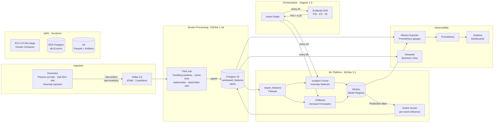
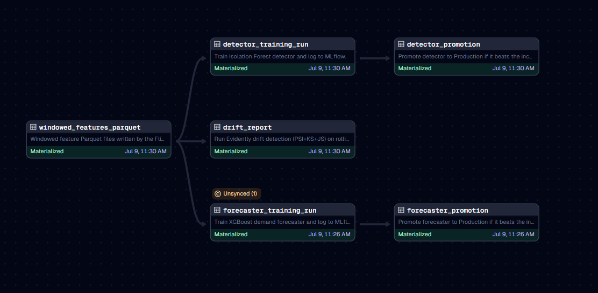
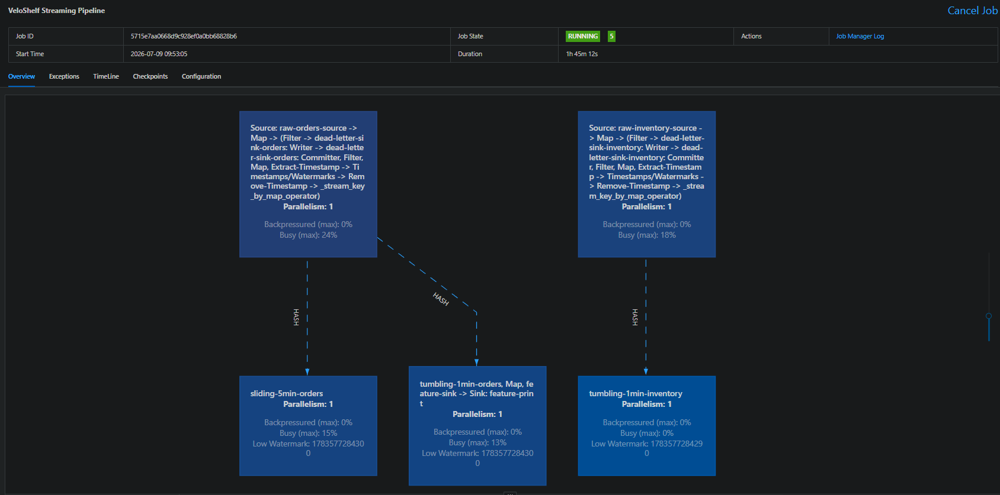
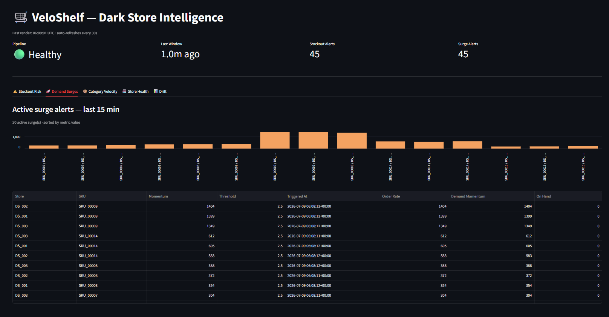
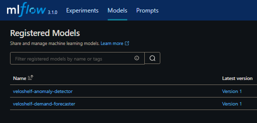
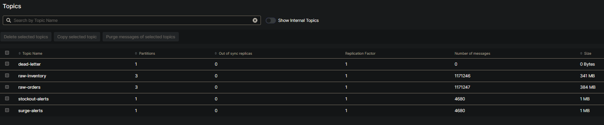
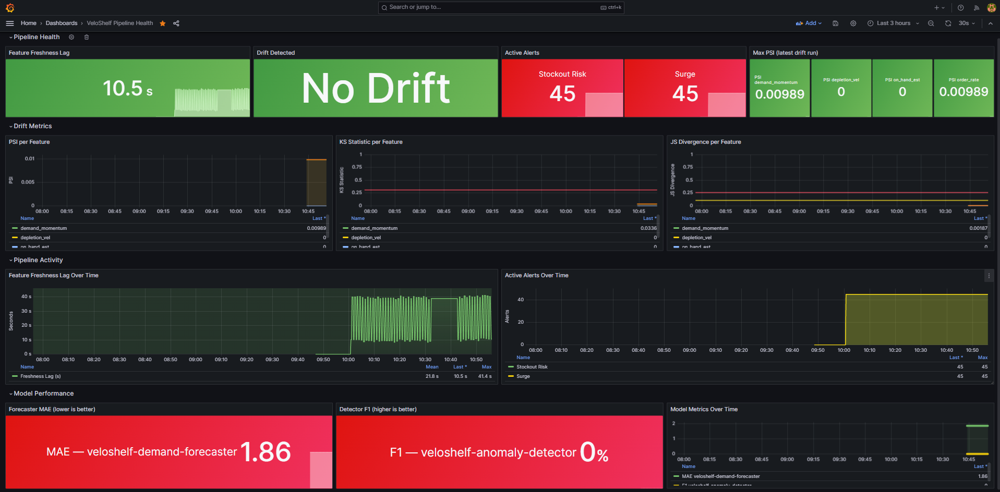

# VeloShelf

Real-time inventory intelligence for quick-commerce dark stores — a production-grade streaming ML platform that covers the full lifecycle from raw events to closed-loop model retraining.

---

## Architecture



---

## Screenshots

### Dagster — Asset Graph


*Five assets wired as a DAG: windowed features → detector + forecaster training → promotion. Drift sensor auto-triggers retraining when PSI > 0.25.*

### Flink — Running Job


*PyFlink 1.18 streaming job: event-time tumbling windows, watermarks, dead-letter quarantine. Shows live throughput and back-pressure metrics.*

### Streamlit — Business Dashboard


*Five-tab business view for supply-chain ops: stockout risk sorted by depletion velocity, active surge alerts, SKU velocity by store, store health summary, and Evidently drift reports.*

### MLflow — Model Registry


*Two registered models (Isolation Forest anomaly detector + XGBoost demand forecaster) with Production alias. Hot-swap loader polls every 5 min — no Flink restart needed.*

### Kafka UI — Live Topics


*Five topics: raw-orders, raw-inventory (generator → Flink), stockout-alerts, surge-alerts (Flink → consumers), dead-letter (quarantined invalid events).*

### Grafana — Pipeline Health


*Four sections: Pipeline Health (freshness lag, drift status, active alerts, max PSI) · Drift Metrics (PSI / KS / JS per feature over time) · Pipeline Activity · Model Performance (MAE, F1).*

---

## What it does

| Capability | Detail |
|---|---|
| **Synthetic load** | Poisson order arrivals, Zipf SKU distribution, configurable anomaly injection |
| **Streaming features** | 1-min tumbling windows → `order_rate`, `depletion_vel`, `demand_momentum`, `on_hand_est` |
| **Anomaly detection** | Isolation Forest trained on windowed features, served online per event |
| **Demand forecasting** | XGBoost forecaster, MAE-optimised, promoted to MLflow Production |
| **Drift monitoring** | Evidently computes PSI / KS / JS every 2 h; sensor auto-retriggers training when PSI > 0.25 |
| **Closed-loop retraining** | Cooldown-gated retrain jobs fire automatically — no human intervention |
| **Observability** | Prometheus scrapes feature freshness, alert counts, model MAE / F1, drift metrics |

---

## Tech stack

| Layer | Technology |
|---|---|
| Event streaming | Apache Kafka 3.8 (KRaft mode, dual listeners) |
| Stream processing | PyFlink 1.18 — event-time tumbling windows, watermarks, dead-letter |
| Serving store | Postgres 16 |
| ML training | Scikit-learn (IsolationForest), XGBoost |
| Experiment tracking | MLflow 3.1 — model registry, artifact store |
| Orchestration | Dagster 1.9 — asset graph, schedules, drift sensor |
| Drift detection | Evidently — PSI, KS statistic, Jensen-Shannon divergence |
| Metrics | Prometheus + Grafana 10 |
| Business dashboard | Streamlit |
| IaC | Terraform 1.7 (VPC, EC2, RDS, S3, IAM) |
| CI / CD | GitHub Actions — lint + test on PR, SSH deploy on merge to main |

---


## Local development

**Prerequisites:** Docker, conda

```bash
# 1. Create environment
conda create -n veloshelf python=3.11 -y
conda activate veloshelf
pip install -e ".[dev]"

# 2. Start all services
make up
make initdb
make topics

# 3. Submit the Flink job and start the event generator
make flink-submit
python -m generator.producer --mode fast

# 4. Train models (after ~5 min of feature accumulation)
make export-features
make train
make forecast
```

**Service URLs (local):**

| Service | URL | Credentials |
|---|---|---|
| Flink UI | http://localhost:8081 | — |
| Kafka UI | http://localhost:8080 | — |
| MLflow | http://localhost:5000 | — |
| Dagster | http://localhost:3000 | — |
| Grafana | http://localhost:3001 | admin / veloshelf |
| Streamlit | http://localhost:8501 | — |
| Prometheus | http://localhost:9090 | — |

---

## AWS deployment

```bash
# One-time: create Terraform state bucket
aws s3 mb s3://veloshelf-tfstate-<account-id> --region ap-south-1

# Copy and fill variables
cp infra/terraform.tfvars.example infra/terraform.tfvars

# Provision (~10 min — RDS is the slow part)
make infra-up

# SSH in and start the stack
make ec2-ssh
```
---

## Repository layout

```
veloshelf/
├── generator/          # Synthetic event producer (Poisson, Zipf, anomaly injection)
├── streaming/          # PyFlink job, online scorer, Postgres + dead-letter sinks
├── ml/                 # Feature export, anomaly detector training, demand forecaster
├── orchestration/      # Dagster assets, schedules, drift-retrain sensor
├── observability/      # Evidently drift job, Prometheus metrics exporter, retrain trigger
├── serving/
│   └── grafana/        # Datasource + dashboard provisioning (auto-loaded on startup)
├── infra/
│   ├── main.tf         # Root Terraform module
│   ├── variables.tf
│   ├── modules/
│   │   ├── networking/ # VPC, subnets, internet gateway
│   │   ├── ec2/        # Instance, IAM role, security group
│   │   ├── rds/        # Postgres, subnet group
│   │   └── s3/         # Feature Parquet + MLflow artifact buckets
│   └── init_db.sql     # Schema: windowed_features, alerts
├── .github/workflows/
│   ├── ci.yml          # Lint + test on every PR
│   └── deploy.yml      # SSH deploy on push to main
└── docker-compose.yml  # Full local stack (12 services)
```
